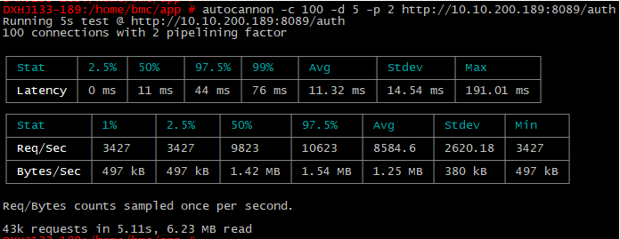

### 初识庐山

大神用Node.js写的http服务性能测试工具：autocannon

### 背景简介

A HTTP/1.1 benchmarking tool written in node, greatly inspired by wrk and wrk2, with support for HTTP pipelining and HTTPS.
On my box, autocannon can produce more load than wrk and wrk2.

Github: [https://github.com/mcollina/autocannon](https://github.com/mcollina/autocannon)

感兴趣的同学可以详细了解！